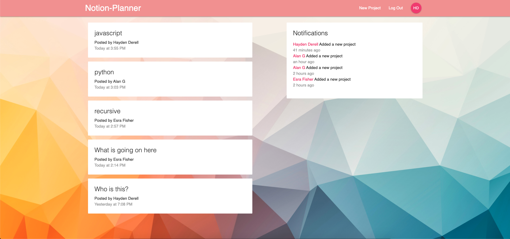
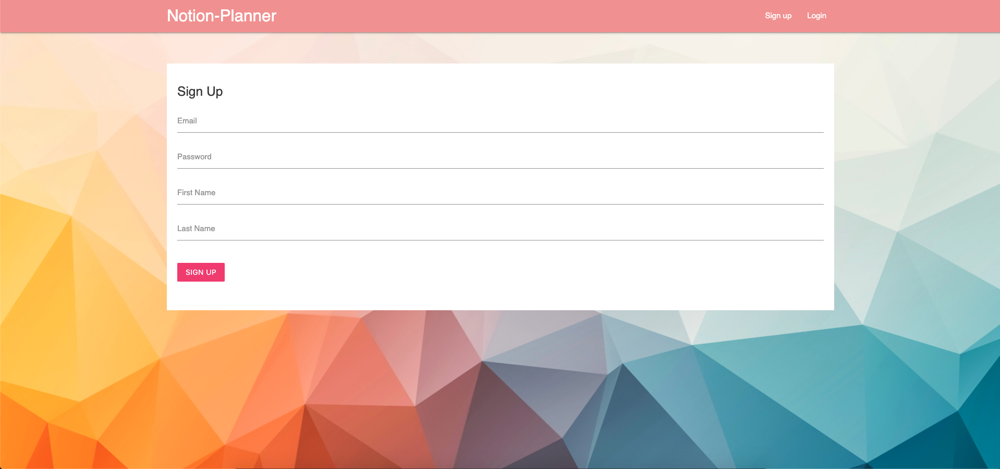
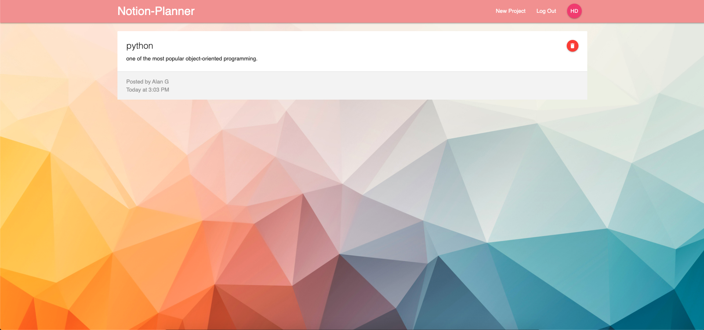
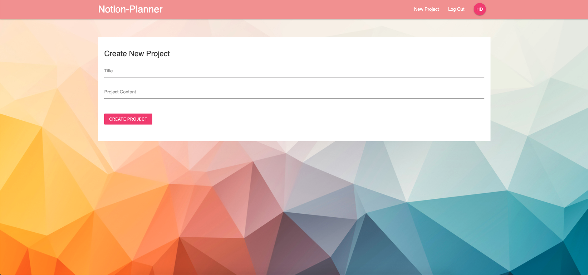

## pawUp-clientside

Connect your pets with pets from your neighborhood.

## Link: https://notion-planner.web.app/

## Built with

Front-End:
Materialize.css, React & Redux
Back-End:
Firebase DB, Firebase auth & Cloud Functions

### ProjectPlan

### LandingPage

### LandingPagewithSignedIn

### SignUpPage

### ProjectDetails

### CreateProject

## Features

    -Create a user profile
    -Create projects
    -Delete projects
    -Update project
    -user able to see who create project and when created
    -in notifications projects sorted by created time
